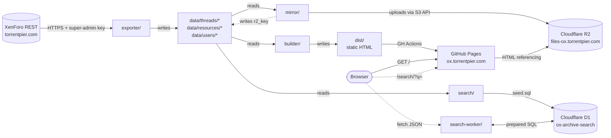
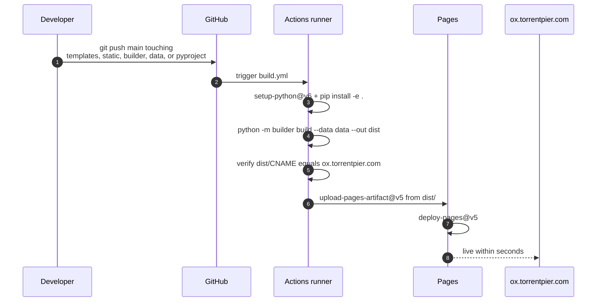

# Architecture

The archive is a one-way pipeline: pull the live XenForo data into JSON,
mirror binaries to R2, render static HTML, index post text into D1, and
serve the result from three independent Cloudflare-adjacent edges.

## Data flow



The three serving surfaces are independent. R2 can be rotated without
touching the HTML (re-mirror writes new `r2_key`s into `data/` and the
next builder run picks them up). The search Worker is a thin shell over
D1 — re-indexing means re-running `search/index.py` and re-importing
`seed.sql`. The HTML is fully self-contained: drop GitHub Pages, point
any HTTP server at `dist/`, the archive keeps working.

## Search request flow

```mermaid
sequenceDiagram
    autonumber
    participant U as User
    participant P as Pages
    participant W as Worker
    participant D as D1

    U->>P: GET /search/?q=торренты
    P-->>U: search.html with form and JS
    Note over U: JS reads q from URL,<br/>fires fetch to the Worker
    U->>W: GET /search?q=торренты&limit=20&offset=0
    Note over W: tokenise, lowercase, ё→е,<br/>Snowball stem,<br/>build FTS5 MATCH query
    W->>D: posts_fts MATCH, LIMIT 21 OFFSET 0
    D-->>W: 20 rows plus 1 sentinel
    Note over W: re-tokenise body_plain,<br/>build snippet with mark tags
    W-->>U: JSON with results and has_more
    Note over U: render cards;<br/>show Load more when has_more
```

The Worker fetches `limit + 1` rows instead of issuing a separate `COUNT`
query — D1 round-trips are ~50 ms each in this region, and we only need
to know whether *more* exist, not how many.

## Build & deploy



Workflow lives at `.github/workflows/build.yml`. Path-filter triggers on
`data/`, `templates/`, `static/`, `builder/`, `pyproject.toml`, the
workflow itself. The build is deterministic (`build_time` pinned to
`meta.exported_at`) — same `data/` produces a byte-identical `dist/`.

## Module breakdown

### `exporter/`

CLI: `xf-export {nodes,threads,resources,profile-posts,resource-reviews,resource-updates,wall-owners}`.

- `api.py` — `XfClient` (httpx + tenacity retry + token-bucket rate
  limiter; default 3 rps via `XF_API_RPS`).
- `io.py` — atomic JSON writer (`tempfile` + `os.replace`).
- `nodes.py` — `/api/nodes` → `data/meta.json` (`tree_map`, full nodes,
  `by_type` index, `forum_ids`).
- `threads.py` — paginates `/api/forums/{id}/threads` then per-thread
  `/api/threads/{id}/?with_posts=1&page=N`; merges pages into one JSON.
  `post.User` is captured into a shared `UserCache`. `--force` preserves
  per-attachment `r2_key`s set by `mirror`.
- `users.py` — `UserCache.flush()` writes one user JSON per id;
  preserves `avatar_r2_key`, `wall_posts`, `wall_total`, `wall_access`.
- `resources.py` — `/api/resources` collection + per-resource detail
  with `versions[].files[]`. Handles
  `400 xfrm_this_resource_is_not_versioned` (single-file resources).
- `profile_posts.py` — `/api/users/{id}/profile-posts` paginated, plus
  `/api/profile-posts/{id}/comments` when the post has more comments
  than the embedded `LatestComments`.
- `resource_reviews.py` — `/api/resource-reviews` collection, bucketed
  by `Resource.resource_id`, rewritten into each
  `data/resources/{id}.json` under `reviews[]`.
- `resource_updates.py` — per-resource updates via
  `/api/resources/{id}/updates/` (trailing slash is significant; XF
  returns 404 without it).

Auth lives in `.env` — `XF_API_URL`, `XF_API_KEY`, `XF_API_USER`. The
key has super-admin and `XF-Api-Bypass-Permissions: 1` is sent on every
request.

### `mirror/`

CLI: `xf-mirror {upload,verify,scan} [--only attachments|avatars|resources|inline] [--data data]`.

- `r2.py` — boto3 client against the R2 S3 endpoint (`head`, `put`,
  `public_url`).
- `download.py` — httpx-based downloader, anonymous by default; flips
  to the XF-Api-Key path for resource version files (their
  `download_url` is an authenticated API endpoint).
- `keys.py` — pure, ASCII-safe, deterministic R2-key helpers.
- `inline.py` — `InlineIndex` persisted at `data/inline_index.json`.
  Dedupes by sha256 across URLs. Permanent 4xx URLs are recorded so
  re-runs don't refetch them.
- `pipeline.py` — four idempotent stages
  (`mirror_attachments`, `mirror_avatars`, `mirror_resources`,
  `mirror_inline`) plus `verify` (HEAD every `r2_key`). `current_files`
  alias the matching version-file `r2_key` instead of uploading twice.

Bucket layout:

```
attachments/{attachment_id}/{filename}
avatars/{user_id}{ext}                              (size "h")
inline/{sha256[:2]}/{sha256}{ext}
resources/{resource_id}/icon{ext}
resources/{resource_id}/v/{version_id}/{filename}
```

### `builder/`

CLI: `xf-build build --data data --out dist`.

- `render.py` — Jinja2 environment + filters (`timestamp`, `filesize`,
  `urlpath`).
- `rewrite.py` — sanitises `message_parsed`: strips `<script>` and
  `on*` handlers, drops `<iframe>` outside the YouTube allowlist, adds
  `loading=lazy` and `decoding=async`, rewrites internal links to
  relative paths with canonical slugs, swaps asset URLs to R2 via the
  `asset_url_map` built from `r2_key` annotations.
- `site.py` — loads `data/`, builds the forum / category / resource
  indexes, renders every page (forum 30/page, thread 10/page, members
  index 30/page).

URL scheme is byte-identical to XenForo's defaults
(`/threads/<slug>.<id>/page-N/`, `/forums/<slug>.<id>/page-N/`,
`/members/<slug>.<id>/`, `/resources/<slug>.<id>/`,
`/posts/<id>/` redirects). Old links from search engines / chats keep
working without redirect rules.

### `search/`

CLI: `xf-search build --data data --db search/local.db --sql search/seed.sql`.

- `text.py` — HTML→plain via BeautifulSoup, then `\w+` tokenise +
  lowercase + `ё→е` + Snowball stem on Cyrillic-bearing tokens. The
  `ё→е` normalisation is explicit because the Python `snowballstemmer`
  package normalises internally while the npm `snowball-stemmers` JS
  port does not — without the explicit step the index and the Worker
  disagree on every `ё`-bearing word.
- `index.py` — walks `data/threads/*.json`, writes one row per thread,
  one row per post (with `body_plain` capped at 32K chars — D1 rejects
  single statements over ~100 KB), and one FTS5 row per post. Emits a
  plain-SQL dump in the same pass; D1 forbids `PRAGMA writable_schema`,
  `BEGIN TRANSACTION` and direct INSERTs into FTS5 shadow tables, so
  `sqlite3 .dump` output is not directly importable.

Re-import:

```bash
wrangler d1 execute ox-archive-search --remote \
  --command "DROP TABLE IF EXISTS posts_fts; \
             DROP TABLE IF EXISTS posts; \
             DROP TABLE IF EXISTS threads;"
wrangler d1 execute ox-archive-search --remote --file=search/seed.sql
```

### `search-worker/`

Cloudflare Worker. Routes:

- `https://search-ox.torrentpier.com/search?q=…` (production)
- `https://ox-archive-search.<subdomain>.workers.dev/search?q=…` (dev fallback)

`src/text.ts` mirrors `search/text.py` byte-for-byte (verified identical
stems on 2,000 sampled corpus tokens). `src/snippet.ts` re-tokenises
`body_plain` against the query stems and emits a ±90-char window with
`<mark>`-highlighted matches. `src/index.ts` validates input
(length 2..200), clamps limit to ≤50 and offset to ≤5,000, wraps each
stem in `"..."` for FTS5 (implicit AND between stems), fetches
`limit + 1` rows to set `has_more` without an extra `COUNT`.

`wrangler.jsonc` declares:
- `placement: { mode: "smart" }` — co-locates the Worker with D1.
- `upload_source_maps: true` — readable stack traces in error logs.
- `observability.logs` with `invocation_logs: true` — every request is
  logged. `traces: true` for distributed-tracing of D1 calls.
- `custom_domain: true` on the route — `wrangler deploy` auto-creates
  the DNS record + LE-issued cert for `search-ox.torrentpier.com`.

## Cloudflare D1 schema

```sql
CREATE TABLE threads (
    id INTEGER PRIMARY KEY, slug TEXT, title TEXT NOT NULL,
    forum_id INTEGER NOT NULL, forum_title TEXT NOT NULL,
    username TEXT, post_date INTEGER, reply_count INTEGER,
    url_path TEXT NOT NULL
);
CREATE TABLE posts (
    id INTEGER PRIMARY KEY, thread_id INTEGER NOT NULL,
    page_no INTEGER NOT NULL, position INTEGER NOT NULL,
    username TEXT, post_date INTEGER, body_plain TEXT NOT NULL
);
CREATE INDEX idx_posts_thread ON posts(thread_id, position);
CREATE VIRTUAL TABLE posts_fts USING fts5(
    body, title, content='',
    tokenize='unicode61 remove_diacritics 2'
);
```

`posts_fts` is contentless: the row data lives in the inverted index
only. `body` and `title` are Snowball-stemmed. `body_plain` stays in
its own table so the Worker can build user-facing snippets from the
original Russian instead of stemmed fragments.

## XenForo API surface (probed live on 2026-05-11)

| Endpoint                                                | Status   | Notes                                                                                       |
|---------------------------------------------------------|----------|---------------------------------------------------------------------------------------------|
| `GET /api/`                                             | 200      | `version_id`, `site_title`, key info                                                        |
| `GET /api/me`                                           | 200      | Acting user                                                                                 |
| `GET /api/nodes`                                        | 200      | Tree via `tree_map` + flat `nodes[]`                                                        |
| `GET /api/forums/{id}/threads?page=N`                   | 200      | **Server-fixed `per_page=30`**, ignores query                                               |
| `GET /api/threads/{id}/?with_posts=1&page=N`            | 200      | Returns `{thread, posts, pagination}`; **server-fixed `per_page=10` for posts**; `Poll` embedded |
| `GET /api/users/{id}`                                   | 200      | Full user incl. `avatar_urls`, `is_admin/moderator/staff`                                   |
| `GET /api/resources?page=N`                             | 200      | Embedded `Category` per resource; server-fixed `per_page=30`                                |
| `GET /api/resources/{id}`                               | 200      | `current_files[]` + `Category`                                                              |
| `GET /api/resources/{id}/versions`                      | 200 / 400 | All versions with `download_url`; **400 `xfrm_this_resource_is_not_versioned`** for single-file resources |
| `GET /api/resources/{id}/reviews/`                      | 200      | Trailing slash matters                                                                      |
| `GET /api/resources/{id}/updates/`                      | 200      | Trailing slash matters                                                                      |
| `GET /api/resource-reviews?page=N`                      | 200      | Collection (every review across every resource)                                             |
| `GET /api/users/{id}/profile-posts?page=N`              | 200 / 403 | Wall listing; 403 `member_limits_viewing_profile` when `allow_view_profile != 'everyone'`, `is_banned`, or `visible == 0` — even for super-admin tokens with `XF-Api-Bypass-Permissions: 1` |
| `GET /api/profile-posts/{id}/comments?page=N`           | 200      | Use this when `comment_count > len(LatestComments)`                                         |
| Attachment download                                     | —        | `direct_url` per attachment object; no separate `/api/attachments/{id}/data`                |
| Resource version file download                          | —        | `download_url` requires `XF-Api-Key` header; mirror has to authenticate                     |

Endpoints that do not exist or are write-only on this forum:
`/api/categories`, `/api/forums` (collection), `/api/tags`,
`/api/resources/categories`, `/api/profile-posts/` (bulk),
`/api/resource-updates` (read; POST-only), `/api/featured-content`,
`/api/media`. Use the alternatives above.

## Decisions worth knowing

| # | Decision | Why |
|---|----------|-----|
| 1 | Intermediate format = JSON, one file per thread / resource / user, checked into git | Source of truth, diffable, trivially editable, easy GDPR-style deletes |
| 2 | Final format = pre-rendered HTML on GitHub Pages | Longevity, $0 cost, archive is read-only forever |
| 3 | Files on Cloudflare R2 with custom domain | GitHub Pages 1 GB repo limit; R2 has 10 GB free tier and zero egress |
| 4 | Search = Cloudflare Worker + D1 (FTS5 with Snowball) | FTS5 + Snowball Russian gives meaningful morphology; Pagefind is literal-only for Russian |
| 5 | Pipeline language = Python (3.11+, running 3.13) | Fast iteration on JSON munging + Jinja2 + BS4 |
| 6 | URL scheme identical to XenForo (`/threads/<slug>.<id>/page-N/`, etc.) | Old links from search engines / chats keep working without redirect rules |
| 7 | Drop deleted/hidden posts, private conversations, reactions | Per spec |
| 8 | Carry text + attachments + avatars + per-post user info + every resource version | Per spec |
| 9 | Hostnames: `ox.torrentpier.com` for HTML, `files-ox.torrentpier.com` for R2, `search-ox.torrentpier.com` for the Worker | Cloudflare universal SSL doesn't cover 4th-level subdomains |
| 10 | Per-endpoint pagination is server-fixed: 30 (forum/thread listings), 10 (thread posts). `per_page` query param is ignored | Verified by probing `per_page=20/30/50/100/200` |
| 11 | Wall export resets XF privacy gates server-side via direct SQL UPDATE: `allow_view_profile='everyone'`, `is_banned=0`, `visible=1` for the 58 affected users | XF respects per-user privacy even for super-admin keys and `XF-Api-Bypass-Permissions: 1`; there is no API-side workaround. Forum is shutting down; the operator owns it and explicitly authorised it. Backup at `/opt/xenforo/data/xf_user{,_privacy}.backup-2026-05-11.sql` |
| 12 | Snowball Russian on both sides, with explicit `ё→е` normalisation in `search/text.py` and `search-worker/src/text.ts` | The Python `snowballstemmer` normalises `ё` internally; the npm `snowball-stemmers` does not. Without explicit normalisation, recall on every `ё`-bearing word would be broken |
| 13 | `body_plain` capped at 32K chars in the indexer | D1 rejects single SQL statements above ~100 KB; only one post out of 45,473 was actually long enough to be truncated |
| 14 | FTS5 `content=''` (contentless) — the inverted index is the only copy of stemmed text | Halves on-disk footprint; user-facing snippets come from `posts.body_plain` instead of `snippet()` |
| 15 | Worker fetches `limit + 1` rows for `has_more` instead of a separate `COUNT` | D1 round-trip is ~50 ms; the sentinel keeps pagination single-query |
